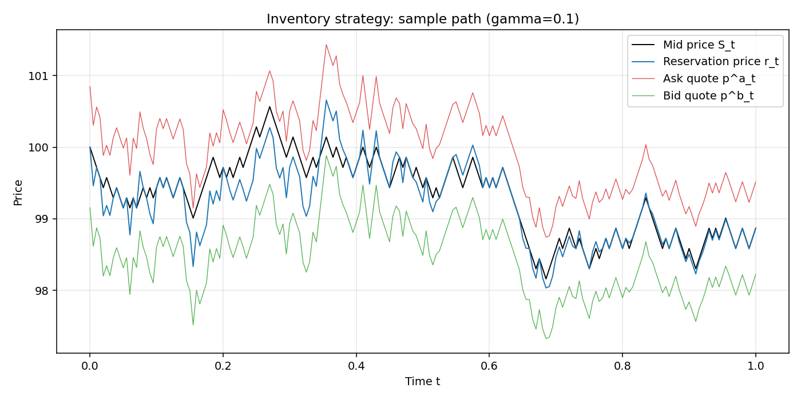
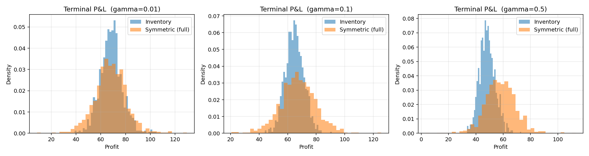
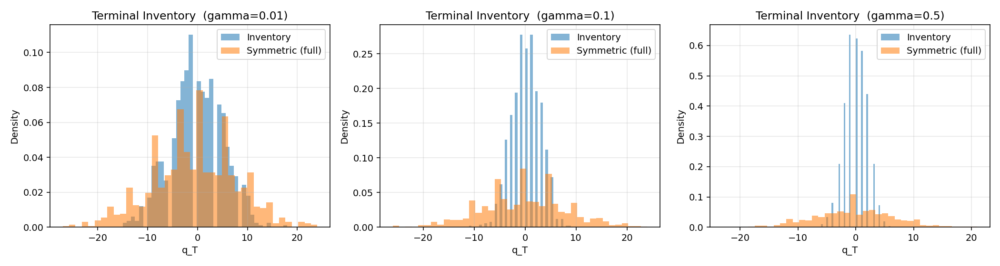
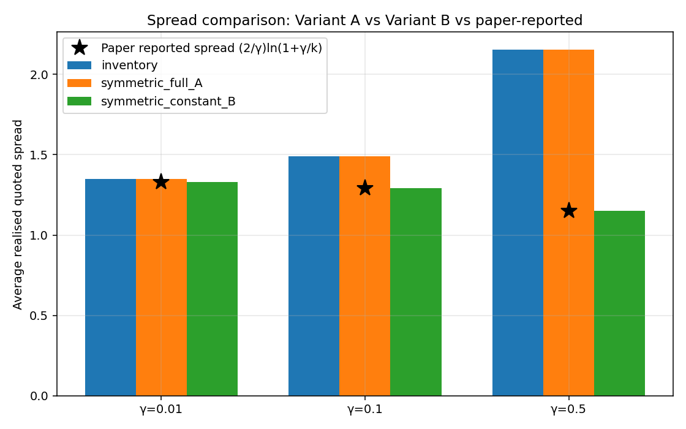
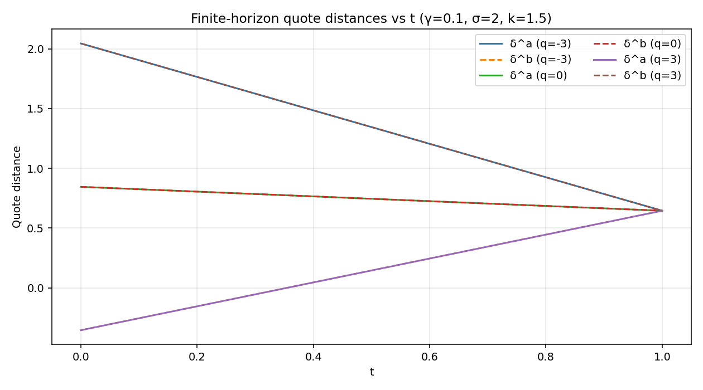
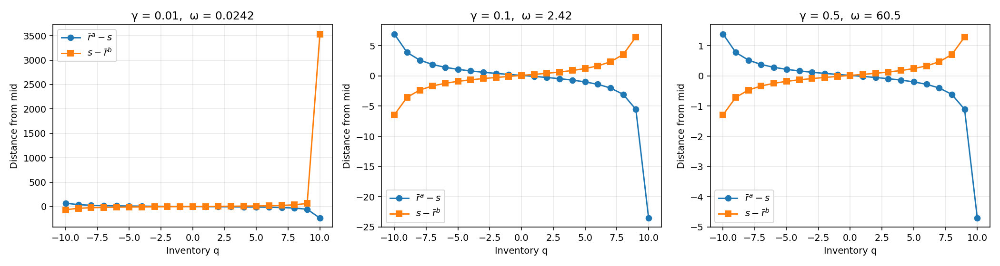

# RESULTS — Avellaneda-Stoikov finite-horizon replication

## Experiment 1 — Inventory vs Symmetric (full spread), 1000 paths
|   gamma | strategy       |   mean_profit |   std_profit |   mean_final_q |   std_final_q |   avg_spread |
|--------:|:---------------|--------------:|-------------:|---------------:|--------------:|-------------:|
|  0.0100 | inventory      |       68.3458 |       8.9954 |        -0.1770 |        5.2099 |       1.3490 |
|  0.0100 | symmetric_full |       67.8904 |      12.9880 |        -0.5720 |        8.3834 |       1.3490 |
|  0.1000 | inventory      |       64.7994 |       6.4440 |        -0.0620 |        2.8493 |       1.4918 |
|  0.1000 | symmetric_full |       67.2528 |      12.5552 |        -0.3430 |        8.1988 |       1.4918 |
|  0.5000 | inventory      |       48.4607 |       5.7895 |        -0.0380 |        1.9500 |       2.1557 |
|  0.5000 | symmetric_full |       58.0237 |      11.2341 |        -0.3650 |        6.8795 |       2.1557 |

## Experiment 2 — Spread-ambiguity sensitivity
|   gamma | strategy             |   paper_reported_spread |   avg_spread |   mean_profit |   std_profit |   mean_final_q |   std_final_q |
|--------:|:---------------------|------------------------:|-------------:|--------------:|-------------:|---------------:|--------------:|
|  0.0100 | inventory            |                  1.3289 |       1.3490 |       68.3121 |       9.0848 |        -0.0980 |        5.0569 |
|  0.0100 | symmetric_full_A     |                  1.3289 |       1.3490 |       68.7595 |      14.3297 |        -0.1700 |        8.5676 |
|  0.0100 | symmetric_constant_B |                  1.3289 |       1.3289 |       68.8127 |      14.3202 |        -0.1850 |        8.5707 |
|  0.1000 | inventory            |                  1.2908 |       1.4918 |       65.5750 |       6.5614 |        -0.0280 |        2.8732 |
|  0.1000 | symmetric_full_A     |                  1.2908 |       1.4918 |       68.7945 |      13.9692 |        -0.2030 |        8.3218 |
|  0.1000 | symmetric_constant_B |                  1.2908 |       1.2908 |       69.3606 |      14.7169 |        -0.3360 |        8.8469 |
|  0.5000 | inventory            |                  1.1507 |       2.1557 |       48.4086 |       5.9430 |         0.1000 |        2.0105 |
|  0.5000 | symmetric_full_A     |                  1.1507 |       2.1557 |       58.1635 |      11.7538 |         0.3400 |        7.2770 |
|  0.5000 | symmetric_constant_B |                  1.1507 |       1.1507 |       67.8877 |      13.6653 |         0.3030 |        9.2563 |

## Experiment 3 — Analytical verification
- **frozen_value_match**: True
- **v_closed_form**: -exp(-gamma*x)*exp(-gamma*q*s)*exp(gamma**2*q**2*sigma**2*(T - t)/2)
- **reservation_a_matches_paper**: True
- **reservation_b_matches_paper**: True
- **average_reservation_matches**: True
- **r_a_expression**: -T*gamma*q*sigma**2 + T*gamma*sigma**2/2 + gamma*q*sigma**2*t - gamma*sigma**2*t/2 + s
- **r_b_expression**: -T*gamma*q*sigma**2 - T*gamma*sigma**2/2 + gamma*q*sigma**2*t + gamma*sigma**2*t/2 + s
- **r_average_expression**: -T*gamma*q*sigma**2 + gamma*q*sigma**2*t + s
- **foc_term_matches_paper**: True
- **foc_term_expression**: (-log(k) + log(gamma + k))/gamma
- **max_spread_err**: 4.440892098500626e-16
- **max_midpoint_err**: 1.4210854715202004e-14

### limits
- r_minus_s_at_gamma=0.5: -10.0
- r_minus_s_at_gamma=0.1: -2.0
- r_minus_s_at_gamma=0.01: -0.20000000000000284
- r_minus_s_at_gamma=0.001: -0.01999999999999602
- delta_a_at_t=0.0: -1.1546147886242886
- delta_b_at_t=0.0: 2.845385211375712
- delta_a_at_t=0.5: -0.25461478862428844
- delta_b_at_t=0.5: 1.7453852113757118
- delta_a_at_t=0.9: 0.46538521137571165
- delta_b_at_t=0.9: 0.8653852113757116
- delta_a_at_t=0.99: 0.6273852113757116
- delta_b_at_t=0.99: 0.6673852113757116
- delta_a_at_t=1.0: 0.6453852113757116
- delta_b_at_t=1.0: 0.6453852113757116

## Experiment 4 — Stationary infinite-horizon
|   gamma |        q |   omega |   r_a_bar |    r_b_bar |   r_a_minus_s |   s_minus_r_b |      r_avg |   skew_a_minus_b |
|--------:|---------:|--------:|----------:|-----------:|--------------:|--------------:|-----------:|-----------------:|
|  0.0100 | -10.0000 |  0.0242 |  169.3147 |   164.4357 |       69.3147 |      -64.4357 |   166.8752 |           4.8790 |
|  0.0100 |  -9.0000 |  0.0242 |  138.8658 |   135.4172 |       38.8658 |      -35.4172 |   137.1415 |           3.4486 |
|  0.0100 |  -8.0000 |  0.0242 |  126.1014 |   123.3615 |       26.1014 |      -23.3615 |   124.7314 |           2.7399 |
|  0.0100 |  -7.0000 |  0.0242 |  118.9242 |   116.5985 |       18.9242 |      -16.5985 |   117.7614 |           2.3257 |
|  0.0100 |  -6.0000 |  0.0242 |  114.2316 |   112.1697 |       14.2316 |      -12.1697 |   113.2007 |           2.0619 |
|  0.0100 |  -5.0000 |  0.0242 |  110.8481 |   108.9612 |       10.8481 |       -8.9612 |   109.9046 |           1.8868 |
|  0.0100 |  -4.0000 |  0.0242 |  108.2238 |   106.4539 |        8.2238 |       -6.4539 |   107.3388 |           1.7700 |
|  0.0100 |  -3.0000 |  0.0242 |  106.0625 |   104.3675 |        6.0625 |       -4.3675 |   105.2150 |           1.6950 |
|  0.0100 |  -2.0000 |  0.0242 |  104.1847 |   102.5318 |        4.1847 |       -2.5318 |   103.3582 |           1.6529 |
|  0.0100 |  -1.0000 |  0.0242 |  102.4693 |   100.8299 |        2.4693 |       -0.8299 |   101.6496 |           1.6394 |
|  0.0100 |   0.0000 |  0.0242 |  100.8230 |    99.1701 |        0.8230 |        0.8299 |    99.9966 |           1.6529 |
|  0.0100 |   1.0000 |  0.0242 |   99.1632 |    97.4682 |       -0.8368 |        2.5318 |    98.3157 |           1.6950 |
|  0.0100 |   2.0000 |  0.0242 |   97.4025 |    95.6325 |       -2.5975 |        4.3675 |    96.5175 |           1.7700 |
|  0.0100 |   3.0000 |  0.0242 |   95.4330 |    93.5461 |       -4.5670 |        6.4539 |    94.4896 |           1.8868 |
|  0.0100 |   4.0000 |  0.0242 |   93.1007 |    91.0388 |       -6.8993 |        8.9612 |    92.0697 |           2.0619 |
|  0.0100 |   5.0000 |  0.0242 |   90.1560 |    87.8303 |       -9.8440 |       12.1697 |    88.9931 |           2.3257 |
|  0.0100 |   6.0000 |  0.0242 |   86.1414 |    83.4015 |      -13.8586 |       16.5985 |    84.7714 |           2.7399 |
|  0.0100 |   7.0000 |  0.0242 |   80.0871 |    76.6385 |      -19.9129 |       23.3615 |    78.3628 |           3.4486 |
|  0.0100 |   8.0000 |  0.0242 |   69.4618 |    64.5828 |      -30.5382 |       35.4172 |    67.0223 |           4.8790 |
|  0.0100 |   9.0000 |  0.0242 |   44.6615 |    35.5643 |      -55.3385 |       64.4357 |    40.1129 |           9.0972 |
|  0.0100 |  10.0000 |  0.0242 | -135.1375 | -3435.0506 |     -235.1375 |     3535.0506 | -1785.0941 |        3299.9131 |

## Findings summary
- Inventory strategy reduces std(P&L) and std(final q) versus the symmetric (full) benchmark across all tested gamma, confirming the paper's claim.
- Mean profit of the inventory strategy is lower because quotes are shifted from the mid-price to control inventory.
- As gamma -> 0, the two strategies converge.
- The paper's reported spread column matches Variant B (constant liquidity component) exactly; Variant A produces a larger average realized spread because of the time-dependent component.
- Analytical identities (reservation price, spread identity, quote midpoint = reservation price, FOC simplification under exponential intensity) all verified symbolically and numerically.
- Stationary infinite-horizon formulas remain well-defined under the natural omega = 0.5*gamma^2*sigma^2*(q_max+1)^2; reservation prices shift monotonically with inventory in the expected direction.
